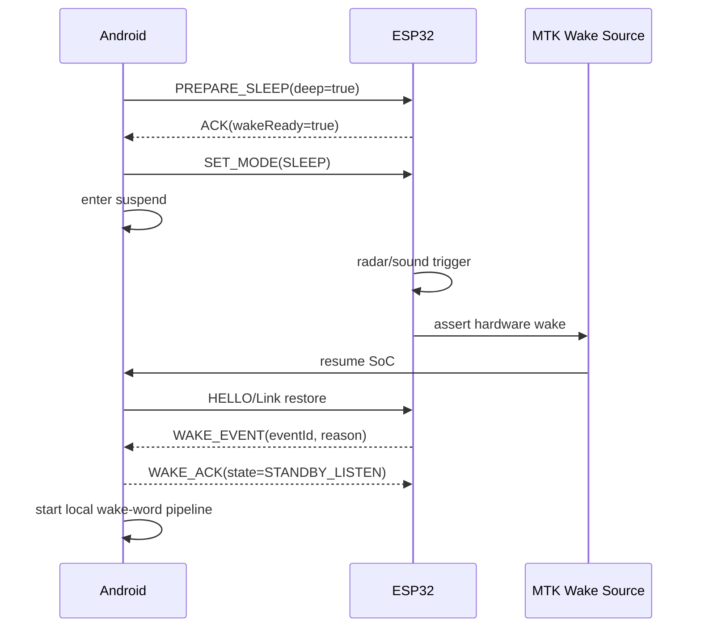
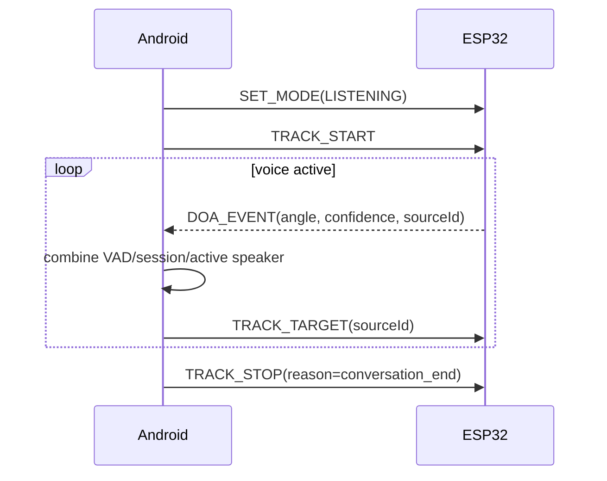

# ESP32—Android 通信协议草案

> 版本：v0.1  
> 目的：作为软件团队与外包硬件团队的接口评审基线。物理链路未定，因此本版先冻结逻辑协议和硬件唤醒要求。

## 1. 双通道原则

1. 硬件唤醒通道：ESP32 必须能在 Android SoC suspend 时触发 MTK 支持的 wake source，例如 GPIO/PMIC/USB wake；具体电气和内核驱动由硬件/MTK 方确认。
2. 数据通信通道：承载雷达、声音、方向、健康状态和控制消息。候选为 USB CDC/串口、UART、BLE；首选顺序需按板级连接、可靠性和系统权限评审。

只使用 BLE/普通应用广播而没有系统级 wake 支持，不视为完成“从真 suspend 唤醒 Android”。

## 2. 链路要求

- 双向、长连接或可在 1 s 内恢复。
- 带协议版本、设备标识、序号、校验、ACK、超时和错误码。
- Android 与 ESP32 重启顺序任意，均可重新握手并恢复期望状态。
- 禁止无限重试；控制命令重试必须幂等。
- 传感器高频数据允许丢弃旧值，以最新值为准；告警和配置命令不得静默丢失。
- Android 不向 ESP32 传递云端 Token、用户对话文本或模型密钥。

## 3. 推荐帧封装

原型期可使用“每行一个 UTF-8 JSON”快速联调；试产前在串口/USB 上采用二进制信封：

| 字段 | 长度 | 说明 |
|---|---:|---|
| Magic | 2 B | 固定 `0xA5 0x5A` |
| Version | 1 B | 协议主版本 |
| Flags | 1 B | ACK/response/error 等 |
| MessageType | 2 B | 消息类型 |
| Sequence | 4 B | 发送方单调递增序号 |
| PayloadLength | 2 B | 负载长度 |
| Payload | N B | CBOR 或 UTF-8 JSON，最终由双方评审 |
| CRC32 | 4 B | 信封和负载校验 |

主版本不兼容时拒绝进入工作态；次版本/新增字段按向后兼容方式忽略。

## 4. 握手与心跳

### 4.1 ESP32 → Android `HELLO`

```json
{
  "type": "HELLO",
  "protocolVersion": "1.0",
  "firmwareVersion": "esp32-x.y.z",
  "deviceId": "base-id",
  "capabilities": {
    "presence": true,
    "soundTrigger": true,
    "doa": true,
    "motion": true,
    "hardwareWake": true
  }
}
```

### 4.2 Android → ESP32 `HELLO_ACK`

```json
{
  "type": "HELLO_ACK",
  "protocolVersion": "1.0",
  "androidVersion": "app-x.y.z",
  "desired": {
    "presenceReportMs": 1000,
    "doaReportMs": 150,
    "soundTriggerEnabled": true
  }
}
```

- 双方每 10 s 心跳；连续 3 次缺失判链路异常，阈值可配置。
- `HEARTBEAT` 包含运行时长、故障位、温度/电源摘要和当前模式。

## 5. ESP32 上行事件

### 5.1 `WAKE_EVENT`

```json
{
  "type": "WAKE_EVENT",
  "eventId": "uuid",
  "reason": "PRESENCE|SOUND|BUTTON|ALERT",
  "sensorTimeMs": 12345678,
  "confidence": 0.91,
  "presence": true,
  "soundLevelDb": 58.2
}
```

- 相同 `eventId` 重发不得重复启动对话。
- `PRESENCE/SOUND` 只进入本地待唤醒；`ALERT` 进入独立告警流程。
- Android 回复 `WAKE_ACK`，含实际状态和是否接受事件。

### 5.2 `PRESENCE_EVENT`

```json
{
  "type": "PRESENCE_EVENT",
  "present": true,
  "confidence": 0.88,
  "distanceMm": 2200,
  "stableForMs": 1500
}
```

要求使用迟滞/稳定时间，避免人在阈值边缘时频繁有人/无人切换。

### 5.3 `SOUND_EVENT`

```json
{
  "type": "SOUND_EVENT",
  "levelDb": 61.0,
  "triggered": true,
  "durationMs": 320,
  "doaDeg": -25,
  "confidence": 0.76
}
```

声音事件不包含原始音频；事件仅作为唤醒 Android 本地模型的条件。

### 5.4 `DOA_EVENT`

```json
{
  "type": "DOA_EVENT",
  "angleDeg": -25.0,
  "confidence": 0.84,
  "voiceActive": true,
  "sourceId": 1,
  "sensorTimeMs": 12345678
}
```

- 角度坐标：面向屏幕中心为 0°，左负右正；范围和零位由机械方给出。
- 有效说话期间建议 5–10 Hz；链路拥塞时丢弃旧事件，只保留最新值。
- `sourceId` 只是硬件短时声源轨迹，不等同用户身份或声纹 ID。

### 5.5 `ALERT_EVENT`

```json
{
  "type": "ALERT_EVENT",
  "eventId": "uuid",
  "alertType": "FALL|INACTIVITY|SENSOR_FAULT|CUSTOM",
  "severity": "INFO|WARNING|CRITICAL",
  "occurredAt": "2026-08-21T12:34:56Z",
  "evidence": {"sensor": "radar", "value": 1}
}
```

告警必须 ACK 并持久到收到 ACK 或达到有界重试上限；Android/云端使用 `eventId` 幂等。

## 6. Android 下行命令

| 命令 | 用途 | 是否要求 ACK |
|---|---|---|
| `SET_MODE` | `SLEEP/STANDBY/LISTENING/SPEAKING/MAINTENANCE` | 是 |
| `SET_REPORTING` | 设置在场/DOA/健康上报频率 | 是 |
| `TRACK_START` | 开启当前对话人的连续跟踪 | 是 |
| `TRACK_TARGET` | 选择 `sourceId` 或指定目标角度 | 否；最新值覆盖 |
| `TRACK_STOP` | 停止跟踪并保持/回中 | 是 |
| `PREPARE_SLEEP` | 询问 ESP32 是否具备唤醒条件 | 是 |
| `PING` | 诊断链路 | 是 |
| `GET_STATUS` | 拉取完整状态 | 是 |

`PREPARE_SLEEP` 只有在 ESP32 返回 `wakeReady=true` 后，Android 才允许进入真 suspend；否则保持 `STANDBY_LISTEN`。

## 7. 休眠/唤醒时序



## 8. 跟踪时序



## 9. 错误码

| 错误 | 含义 | Android 行为 |
|---|---|---|
| `UNSUPPORTED_VERSION` | 协议不兼容 | 禁止动作，显示维护错误 |
| `INVALID_MESSAGE` | 字段/CRC 错误 | 记录并丢弃；阈值告警 |
| `BUSY` | ESP32 正在执行互斥动作 | 有界退避或取消 |
| `WAKE_NOT_READY` | 硬件唤醒未就绪 | 不进入深休眠 |
| `SENSOR_FAULT` | 雷达/声音/DOA 故障 | 上报云端，禁用对应策略 |
| `MOTION_FAULT` | 限位/堵转等 | 立即停止跟踪，提示维护 |
| `LINK_TIMEOUT` | 通信中断 | Android 标记 ESP32 离线并停止下发 |

## 10. 外包接口验收

1. Android 息屏和真 suspend 两种状态各完成 100 次唤醒，成功率达到评审阈值。
2. Android/ESP32 任意顺序重启 50 次均能在 10 s 内完成握手。
3. CRC 错误、截断帧、重复帧、乱序 ACK 不导致崩溃或错误动作。
4. 24 h 心跳无不可恢复断链；断链后自动恢复。
5. 雷达有人/无人边缘场景不频繁抖动。
6. DOA 满速上报不阻塞告警和控制 ACK。
7. 重复 `ALERT_EVENT` 只生成一个平台告警。
8. ESP32 未确认 `wakeReady` 时，Android 不进入真 suspend。

## 11. 待硬件方确认

- MTK 可用 wake pin/wakeup source 和电气时序。
- 数据链路最终选择、波特率/MTU、连接器与驱动。
- ESP32 是否在 Android suspend 时始终供电。
- 雷达/声音/DOA 输出频率、坐标、精度和稳定时间。
- 机械控制归属及可接受的 `TRACK_TARGET` 语义。
- 固件版本查询、远程诊断和未来 OTA 能力。

