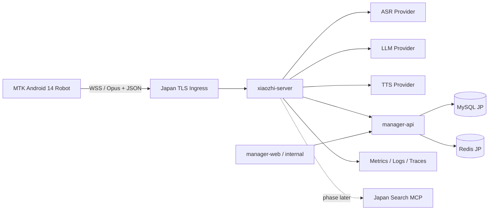

# AI 陪伴机器人对话 MVP 详细设计

> 版本：v0.2  
> 日期：2026-08-20  
> 本版状态：已被《基本功能需求规格-v0.3.md》和《开发计划-v0.3.md》取代，仅保留对话链路设计历史。v0.3 已将声源跟踪、家属 App、基础记忆和 LINE 等纳入一期。

## 1. 可交付目标

在 MTK Android 14 样机上完成稳定的语音对话闭环：启动后自动进入待机，用户开始交互后采集语音，经日本区域服务端完成 VAD/ASR、LLM 回复和 TTS，客户端流式播放并显示状态/表情；支持手动打断、断网恢复和基础远程配置。

首期不承诺免唤醒的全双工对话。建议以“按键/触屏开始 + 回合制自动续聊”为 P0，AEC 验证通过后再开启播报中语音打断。

## 2. 技术基线

| 层 | 基线 | 选择 |
|---|---|---|
| 机器人 UI/业务 | `xiaozhi-android-client` | Flutter 3/Dart，增加 Kotlin 设备层 |
| 实时协议 | 小智 WebSocket v1 | JSON 控制消息 + Opus 二进制音频 |
| 音频 | 16 kHz、mono、PCM16/Opus、60 ms | 保持兼容；性能测试后才允许修改 |
| 实时服务 | `xiaozhi-server` | Python asyncio |
| 管理 API | `manager-api` | Java Spring Boot |
| 管理后台 | `manager-web` | Vue |
| 数据 | MySQL + Redis | 日本区域部署 |
| 测试客户端 | `py-xiaozhi` | Windows 演示与协议自动化 |

## 3. 部署架构



公网仅开放 `443`。`manager-web` 建议通过企业身份或 VPN 访问；`xiaozhi-server` 和 `manager-api` 不直接暴露管理端口。外部模型调用从固定出口发出并记录供应商/地区标签。

## 4. 客户端状态机

主状态：

```text
BOOTING → PROVISIONING/CONNECTING → HANDSHAKING → IDLE
IDLE → LISTENING → THINKING → SPEAKING → IDLE/LISTENING
任意状态 → OFFLINE → CONNECTING
LISTENING/THINKING/SPEAKING → ABORTING → IDLE
不可恢复错误 → DEGRADED
```

约束：

- 只有 `HANDSHAKING` 收到合法 `hello` 后才能进入 `IDLE`。
- 每个状态转换携带 `reason`、时间和 `session_id`；非法转换记录指标但不崩溃。
- 新一轮开始时生成 `turn_id`；晚到的旧 TTS 音频不得播放。
- `abort` 后立即停止本地播放/上传，再通知服务端；不能等待服务端 ACK 才停止。
- 断线后清空未确认的音频帧和旧会话，不跨连接重放用户语音。

## 5. 音频管线

### 5.1 上行

`AudioRecord/record stream → PCM16 mono → ring buffer → 960 samples/60 ms → Opus encoder → bounded queue → WebSocket`

- ring buffer 必须保留不足一帧的尾部，禁止补静音后立即发送，也禁止丢弃一块中的第二帧及后续数据。
- 发送队列设帧数上限；网络跟不上时终止本轮并提示弱网，不无限堆积造成高延迟。
- 每轮记录采集、编码、排队和发送耗时，不记录原始音频内容。
- MTK HAL 支持时启用硬件 AEC/NS/AGC；必须用扬声器参考信号进行验证。

### 5.2 下行

`WebSocket Opus → turn/session 校验 → jitter buffer → Opus decoder → PCM queue → AudioTrack/player`

- 播放缓冲目标以实测调优，首期建议 120–240 ms 范围。
- `tts:start` 创建播放轮次，`tts:stop` 或 `abort` 清空队列。
- 获取语音通信/媒体焦点，处理蓝牙、耳机插拔和系统提示音抢占。
- 播放时若 AEC 未验收，暂停上行采集，采用半双工保证稳定。

### 5.3 VAD 策略

MVP 使用服务端 Silero VAD，客户端持续发送一轮中的音频。老年模式需配置：开始阈值、结束静音、最短语音、最大语音和前后滚动缓存。初始建议只作为实验默认值，不写入最终验收；用实际老人慢语速录音集确定。

端侧 VAD 在以下条件满足后加入：服务端 VAD 已有基准、网络上行成本需要优化、端侧模型在 MTK 上功耗和漏检合格。端云 VAD 并存时，端侧负责节流和交互，服务端仍负责最终端点判断。

## 6. WebSocket 会话协议

连接：`wss://<jp-domain>/xiaozhi/v1/`

握手头：

- `Authorization: Bearer <short-lived-device-token>`
- `Device-Id: <stable-device-id>`
- `Client-Id: <installation-id>`
- `Protocol-Version: 1`
- 建议新增 `Client-Version`、`Device-Model`、`Region: JP`

客户端 `hello` 保持上游兼容：

```json
{
  "type": "hello",
  "version": 1,
  "transport": "websocket",
  "features": {"emoji": true, "mcp": false},
  "audio_params": {
    "format": "opus",
    "sample_rate": 16000,
    "channels": 1,
    "frame_duration": 60
  }
}
```

服务端返回 `hello` 后客户端保存服务端生成的 `session_id`。控制消息至少覆盖 `listen(start/stop/detect)`、`abort`、`stt`、`tts(sentence_start/start/stop)`、`emotion`、`error`。二进制帧在 v1 中依赖当前会话；v2 才考虑显式帧头、序号和时间戳，避免首期破坏兼容。

兼容规则：未知 JSON 字段忽略、未知消息类型记录一次采样日志、必填字段缺失进入可恢复错误；所有扩展先由 `features` 协商。

## 7. 服务端请求流程

1. TLS 入口完成基础限流，实时服务校验设备 Token 和状态。
2. 创建连接上下文和 Trace，等待客户端 `hello`。
3. 收到 `listen:start` 后接收 Opus；VAD/ASR Provider 输出最终文本。
4. 服务端发送 `stt`，加载设备智能体 Prompt 和当前短期上下文。
5. LLM 流式生成；按安全句界切分到 TTS Provider。
6. 服务端发送 TTS 状态、表情语义和 Opus 音频。
7. 客户端播放完成或用户 `abort`，服务端释放队列和本轮任务。
8. 异步写入脱敏指标；MVP 默认不保留原始音频，文本保留策略待确认。

## 8. Prompt 与日本本地内容

Prompt 分层：不可覆盖的安全规则 → 产品角色 → 用户语言/个性参数 → 当前会话 → 工具结果。每次调用记录模板版本、模型路由和参数，不默认记录完整用户正文。

日本搜索作为服务端工具预留：

```text
SearchIntent → SourceRouter → JapanSearchProvider → Normalize/Cite → LLM
```

正式接入前需用户提供：目标场景、网站/数据 API、语言、地域粒度、更新频率和授权条件。MVP 可先实现接口与 mock，不使用通用网页抓取作为生产答案源。

## 9. 身份、安全与隐私

- 首次激活使用一次性注册码换取设备身份，长期 Secret 存 Android Keystore；访问 Token 短期化。
- Release 构建禁止 `test-token`、debug 签名、明文 WebSocket 和包含 Token/正文的日志。
- 管理后台与设备通道分开鉴权；模型 API Key 只在服务端。
- 默认不存原始语音；是否保存转写、保存多久及谁可查看为下一轮 P0 决策。
- 日本用户的数据流图需列出每个 ASR/LLM/TTS 处理地点。向日本境外第三方提供个人数据的具体合规方式须依据日本 APPI 由专业人员确认。[日本 PPC 官方指南](https://www.ppc.go.jp/personalinfo/legal/guidelines_offshore/)
- 提供日文/中文可理解的麦克风状态、隐私告知、同意撤回和删除入口。

## 10. 可观测与 SLO 初稿

每轮关键时间点：`capture_start`、`speech_end`、`asr_final`、`llm_first_token`、`tts_first_audio`、`playback_start/end`。

MVP 试点目标：

- 正常网络下“说完到首段可听语音”P50 ≤ 1.5 s，P95 ≤ 3.0 s。
- 30 分钟连续对话无崩溃、无永久假连接、无跨轮音频。
- 断网恢复后 30 s 内重新进入可用状态（网络本身恢复后）。
- 客户端音频队列无界增长次数为 0。
- 严格目标需在日本实机网络和候选模型基准后冻结。

## 11. 测试设计

### 11.1 自动化

- PCM 分块随机化测试：任意块大小输入后，输出帧样本总量守恒。
- Opus golden 测试：Android、Python 和服务端相互编解码。
- 协议 mock server：握手超时、错误消息、断线、乱序 TTS、旧会话音频。
- 状态机属性测试：所有事件序列均不进入非法/卡死状态。
- 服务端 Provider 契约与故障注入：超时、限流、空结果、半流中断。

### 11.2 实机

- MTK Android 14：冷启动、开机启动、息屏/亮屏、前后台、网络切换、持续运行。
- 声学：1/3/5 米、安静/电视/厨房噪声、扬声器多音量、慢语速和东北口音。
- 打断：AEC 开/关、不同距离和音量的成功率/误触发率。
- 日本网络：至少两种固定宽带和移动热点，记录各供应商分段延迟。

## 12. MVP 完成定义

- 可复现的服务端与 Android Release 构建，无开发机绝对路径和默认密钥。
- 从设备激活到 30 分钟连续对话的主流程通过。
- 音频守恒、协议、状态机、弱网和隐私日志测试通过。
- 日本区域环境有监控、告警、备份和回滚手册。
- 已确定模型供应商、处理地区、成本上限和数据保留政策。
- 已知 S0/S1 问题为 0；S2 有明确规避和修复计划。

## 13. 本轮仍待确认

1. 第一批用户主要使用中文、东北方言、日语还是混合语言？
2. MTK 平台的具体 SoC/开发板、音频 HAL、麦克风/扬声器及厂商 SDK 资料何时提供？
3. 已有日本云账号/偏好云厂商吗？允许调用中国境内的豆包 ASR/TTS/LLM 吗？
4. MVP 交互入口是触屏按钮、实体按键、唤醒词，还是设备启动后持续自动对话？
5. 对话文本是否保存；若保存，保留多久、谁能查看？
