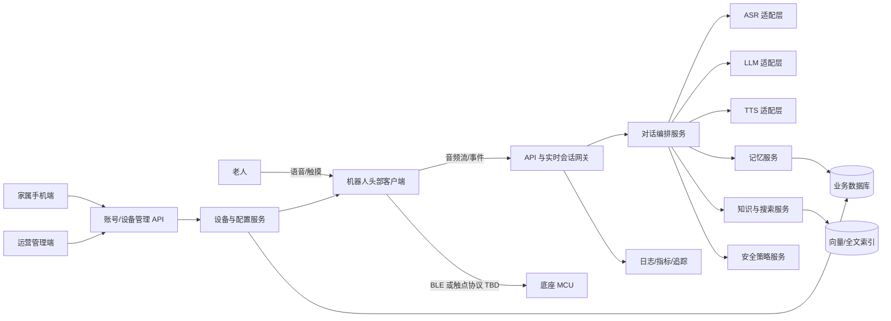

# AI 陪伴机器人详细设计文档

> 版本：v0.1（需求澄清稿）  
> 日期：2026-08-20  
> 状态：总体路线图；对话 MVP 的当前实施基线已收敛至《对话MVP详细设计-v0.2.md》。所有标有 `TBD` 的内容均未形成最终决策。

## 1. 文档目的

本文档将《需求概要设计》和《对话服务需求设计》细化为可开发、可测试、可验收的系统方案，覆盖机器人客户端、手机端/管理端、云端服务以及头部与底座硬件协同。

## 2. 产品目标与边界

### 2.1 核心用户与目标

- 核心用户：以独居或需要陪伴的老年人为主，初期重点适配东北方言和在日生活场景。
- 主要价值：低学习成本的自然语音陪伴、可靠的情绪回应、适度主动关怀、家庭成员远程配置与设备运维。
- 第一阶段目标：完成可稳定持续对话的样机闭环，而非一次性覆盖所有智能家居和内容服务。

### 2.2 第一阶段范围（建议 MVP）

- 设备初始化、Wi-Fi 配网、音量/亮度和基础功能设置。
- 唤醒、端侧 VAD、语音采集、流式识别/对话/合成、音频播放。
- 基本人设与可配置聊天特性；基础情感识别和表情联动。
- 声源方向输入、头部水平/垂直转动、动作安全限位。
- 设备账号绑定、在线状态、电量、网络和硬件健康上报。
- Prompt 版本管理、灰度发布和回滚。
- 基础日志、指标、告警以及最小隐私与内容安全能力。

### 2.3 后续阶段

- 长短期记忆、亲情档案、主动对话和更精细的个性自适应。
- 音乐/版权内容、搜索和第三方服务、知识库自动采集。
- OTA、触摸屏、眼球联动、红外/蓝牙网关、毫米波或摄像头。
- 方言微调与跨境链路专项优化。

### 2.4 明确不在首期承诺的内容

- 医疗诊断、用药建议或替代紧急呼救设备。
- 无授权音频内容分发。
- 未经用户明确授权的持续录音、摄像或家庭成员监听。
- 完全离线的大模型对话（是否需要离线降级能力为 `TBD`）。

## 3. 设计原则

1. 老年友好：语音优先、大字和高对比度、低步骤、失败可恢复。
2. 流式优先：音频、ASR、LLM、TTS 均尽可能流式化，以首包延迟为核心指标。
3. 端云分工：唤醒、VAD、播放控制、安全限位留在设备端；复杂理解、记忆和策略在云端。
4. 可替换供应商：ASR、LLM、TTS、搜索和内容源通过统一适配层接入。
5. 隐私最小化：默认少采集、可查看、可删除、可撤回授权。
6. 可观测和可回滚：Prompt、模型路由、配置和固件均需要版本化。

## 4. 系统上下文与逻辑架构



### 4.1 部署单元建议

- 机器人客户端：建议 Android 应用运行于头部主控；具体 Android 版本与芯片 `TBD`。
- 底座控制：ESP32/其它 MCU `TBD`，负责舵机执行、限位、状态采集和故障保护。
- 移动客户端：首期可选择 Android/iOS 跨平台或响应式 Web；形态 `TBD`。
- 管理后台：Web 管理门户。
- 云端：初期采用“模块化单体 + 独立实时网关”，减少微服务运维成本；当容量或团队边界明确后拆分。

## 5. 关键业务流程

### 5.1 首次配网与绑定

1. 设备首次启动进入配网模式，播报并显示简单指引。
2. 手机端通过 BLE 或设备热点发现设备，传递 Wi-Fi 凭据。
3. 设备使用出厂身份向云端注册，换取短期凭据；禁止将长期密钥写入普通应用存储。
4. 手机用户扫码或输入一次性码完成绑定。
5. 服务端创建用户—家庭—设备关系并下发基础配置。
6. 设备完成音频、屏幕、舵机和网络自检，返回结果。

异常要求：配网失败可重试且不丢失设备身份；解绑需要设备物理确认或原管理员授权；恢复出厂设置清除个人数据和访问令牌。

### 5.2 一轮流式对话

状态机：`IDLE → LISTENING → THINKING → SPEAKING → IDLE`，任何状态均可进入 `ERROR/RECOVERING`；第二阶段支持 `SPEAKING → LISTENING` 打断。

1. 本地唤醒后播放短提示音并点亮表情。
2. 客户端建立鉴权后的实时会话，持续上传带序号的音频帧。
3. VAD 产生开始/结束事件；服务端返回临时识别结果和最终文本。
4. 编排服务加载人设、会话摘要、必要记忆和工具结果，调用 LLM。
5. 回复文本按可安全分句的粒度送入 TTS，客户端边收边播。
6. 表情/动作指令与语音片段携带时间线信息；客户端本地校正同步。
7. 会话结束后异步生成摘要、候选记忆、质量指标和脱敏日志。

建议首期体验指标（需实测后确认）：唤醒成功到开始收音 P95 ≤ 300 ms；用户说完到首段可听语音 P50 ≤ 1.5 s、P95 ≤ 3 s；播放卡顿率 < 1%；这些是产品目标而非当前承诺。

### 5.3 主动对话（第二阶段）

触发源包括用户日程、节日/纪念日、长时间无互动和明确订阅的话题。必须经过免打扰时段、频率上限、用户在场推断和内容安全判断。用户可随时关闭并查看触发原因。

## 6. 机器人客户端详细设计

### 6.1 模块划分

- `Provisioning`：配网、绑定、恢复出厂。
- `AudioCapture`：麦克风阵列输入、AEC/AGC/降噪接口、PCM 帧和设备诊断。
- `WakeWord`：端侧唤醒模型与阈值配置。
- `VAD`：端点检测、老人慢语速延迟策略、最大录音时长。
- `RealtimeSession`：WebSocket/WebRTC `TBD`、重连、序号、心跳和背压。
- `AudioPlayback`：流式缓冲、音量限制、停止与打断。
- `ExpressionEngine`：情绪/状态到动画资源映射；资源版本管理。
- `MotionController`：声源角度到动作规划；限速、限位、防抖和故障降级。
- `DeviceAgent`：配置同步、遥测、命令处理和 OTA 预留。
- `LocalStore`：加密保存令牌和少量配置；不长期保存原始语音为默认策略。

### 6.2 VAD 策略

- 组合能量、模型置信度和语义未完成提示；初始静音、句中停顿、结束静音分别配置。
- 老年模式默认延长结束静音阈值；所有阈值支持远程配置和实验分组。
- 超时后给出明确语音反馈，不悄然丢弃；弱网下先短暂本地缓存，达到上限后停止采集。
- 第二阶段打断采用回声消除后的输入进行唤醒/VAD，避免 TTS 自激活。

### 6.3 表情与动作协议

服务端只下发语义指令，不直接控制 PWM，例如：

```json
{
  "eventId": "evt_uuid",
  "type": "expression.motion",
  "atMs": 320,
  "expression": "smile",
  "motion": {"yawDeg": 20, "pitchDeg": 5, "durationMs": 600},
  "priority": 40,
  "expiresAt": "2026-08-20T12:00:03Z"
}
```

客户端检查能力、限位和过期时间后执行；急停、堵转、温度异常优先级最高。头部到底座协议需要包含帧头、版本、命令、序号、载荷长度、CRC、ACK/错误码和超时重试。

### 6.4 弱网与离线降级

- 连接中断自动指数退避重连，音频帧不无限积压。
- 离线保留音量、亮度、停止播放、恢复网络等本地命令。
- 云端不可用时播报简短、确定性的状态说明。
- 是否提供离线唤醒 + 固定问答、离线 ASR/TTS 为 `TBD`。

## 7. 服务端详细设计

### 7.1 服务边界

| 模块 | 职责 | 主要数据 |
|---|---|---|
| 实时会话网关 | 设备鉴权、音频双向流、心跳、限流 | 临时会话状态 |
| 对话编排 | 状态机、上下文组装、模型/工具调用、事件输出 | 对话轮次、策略版本 |
| 模型适配 | 统一 ASR/LLM/TTS 接口、熔断、路由、成本统计 | 供应商请求元数据 |
| Prompt 策略 | 人设模板、变量校验、版本、灰度、回滚 | Prompt 版本 |
| 记忆 | 记忆提取、确认、检索、遗忘和删除 | 用户事实、摘要、向量 |
| 知识/搜索 | 文档入库、分块、索引、检索、来源治理 | 文档、分块、来源 |
| 设备管理 | 注册绑定、影子状态、配置、命令、OTA 预留 | 设备、遥测、任务 |
| 账号权限 | 用户、家庭、角色、同意记录 | 身份与授权关系 |
| 管理后台 API | 内容、策略、设备、审计、统计 | 管理操作日志 |

### 7.2 对话编排顺序

1. 验证设备、用户、会话和策略版本。
2. ASR 输出文本及置信度；低置信度时澄清，不编造。
3. 意图初筛：闲聊、信息查询、设备控制、提醒、潜在求救。
4. 读取短期上下文；按意图检索少量长期记忆和知识。
5. 组装系统规则、人设、用户偏好、工具结果和安全约束。
6. 调用 LLM；对流式输出做句级安全检查和 TTS 切分。
7. 输出文本、音频、表情和动作事件。
8. 异步质量分析；只有符合规则的内容进入候选长期记忆。

### 7.3 人设与性格参数

首版建议 0–100 的可解释维度：`dialectLevel`、`humorLevel`、`novelVocabularyLevel`、`initiativeLevel`、`responseLength`、`empathyLevel`。每个维度映射为离散策略片段，不直接把数字交给模型解释。系统应记录最终生效值及来源（默认、家属设置、用户设置、自适应），用户显式设置优先于自适应。

### 7.4 情感识别

- 输入：当前文本、近几轮语义和可选声学特征；输出情绪类别、强度、置信度和依据类型。
- 情绪用于选择回应风格，不作为医学判断。
- 对持续悲伤、自伤或求救表达采用专门安全流程；具体联系人和升级规则 `TBD`。
- 低置信度使用温和澄清，避免宣称“我知道你很孤独”。

### 7.5 长短期记忆（第二阶段）

- 短期：最近 N 轮 + 滚动摘要，按 token 预算裁剪。
- 长期类型：个人资料、关系、偏好、重要事件、生活习惯、故事经历。
- 每条记忆保存主体、事实、时间范围、来源会话、置信度、敏感级别、创建/访问时间和过期策略。
- 敏感信息默认进入“候选记忆”，通过自然语言确认或家属/用户授权后持久化。
- 检索同时考虑语义相似、时效、重要度和访问频率；回复中不应泄露其他家庭成员无权查看的信息。
- 遗忘包括 TTL、衰减、冲突替换、用户删除和账号注销级联删除。

### 7.6 知识库和搜索

- 入库流水线：来源登记 → 授权检查 → 抓取/上传 → 清洗 → 分块 → 元数据 → 索引 → 抽检 → 发布。
- 来源必须记录 URL/文件、版权/许可、语言、更新时间和可信等级。
- 回答优先检索批准来源；时效信息必须带来源时间，冲突时表达不确定性。
- 自动抓取遵守站点条款、robots、频率限制和内容版权；目标站点白名单 `TBD`。

### 7.7 模型供应商抽象

统一能力接口：`transcribeStream`、`generateStream`、`synthesizeStream`、`embed`。请求上下文包含租户、地区、语言、超时、成本上限和数据驻留要求。适配器统一错误分类、重试资格、用量和追踪字段。豆包语音 2.0、其它流式语音、本地模型、Gemini/OpenAI 均在基准测试后决定生产路由。

## 8. 数据设计（概念模型）

核心实体：

- `User`、`Family`、`FamilyMember`、`ConsentRecord`
- `Device`、`DeviceBinding`、`DeviceCapability`、`DeviceShadow`、`Telemetry`
- `Conversation`、`Turn`、`TranscriptSegment`、`ModelInvocation`
- `PersonaProfile`、`PromptTemplate`、`PromptRelease`
- `MemoryItem`、`MemoryEvidence`、`MemoryEmbedding`
- `KnowledgeSource`、`Document`、`Chunk`、`IngestionJob`
- `Reminder`、`ProactivePolicy`、`Notification`
- `AuditLog`、`SafetyEvent`、`OtaCampaign`（预留）

原始音频默认不持久化；如为质量改进需要采样，必须单独同意、明确保留期、去标识化并可撤回。业务库建议关系型数据库；缓存/会话用 Redis 类存储；对象存储承载授权文档和固件；向量能力可先使用关系库扩展，规模明确后再独立。

## 9. API 与事件约定

### 9.1 通用约定

- 外部管理 API 使用 HTTPS + JSON，路径版本 `/api/v1`。
- 实时链路使用 `sessionId`、单调递增 `sequence`、`eventId`；支持幂等重放但禁止重复执行动作。
- 时间统一 ISO 8601 UTC；展示层转换到用户时区。
- 错误结构包含稳定错误码、可读提示、是否可重试和追踪 ID。

### 9.2 首期 API 清单

- `POST /devices/claim`、`POST /devices/{id}/unbind`
- `GET /devices/{id}`、`GET /devices/{id}/shadow`
- `PATCH /devices/{id}/config`
- `POST /realtime/sessions`
- `GET/PATCH /persona-profiles/{id}`
- `GET/POST/PATCH/DELETE /reminders`
- `GET /prompt-releases`、`POST /prompt-releases/{id}/publish`（管理端）
- `GET /health`、`GET /ready`

完整 OpenAPI、实时事件 schema 和底座串行/BLE 协议应作为编码前置交付物。

## 10. 安全、隐私与权限

- 角色建议：老人/设备主人、家庭管理员、家庭查看者、客服、内容运营、系统管理员。
- 家属远程能力按最小权限拆分；“查看状态”不隐含“查看对话内容”。
- 设备身份使用每设备唯一证书或等价硬件保护凭据；用户令牌短期化并支持吊销。
- 传输加密、服务端静态加密、密钥托管、管理操作审计。
- 日志默认脱敏，不记录完整访问令牌、Wi-Fi 密码、原始语音和完整 Prompt 上下文。
- 数据驻留、跨境传输、隐私政策适用中国/日本哪一法域为 `TBD`，须在供应商选型前由合规人员确认。
- 内容安全至少覆盖自伤/求救、诈骗诱导、暴力色情、医疗误导和不适宜回复；“政治敏感”策略应依法域和产品政策形成可审计规则。

## 11. 可用性、性能与可观测性

- 首期容量目标、并发设备数、日对话轮次均为 `TBD`。
- 每轮建立统一 Trace，贯穿设备、网关、ASR、LLM、工具和 TTS，但不得把敏感正文无控制写入追踪系统。
- 核心指标：在线率、唤醒率、ASR 字错率、VAD 截断率、首字/首音频延迟、端到端延迟、打断成功率、崩溃率、模型错误率、单轮成本、安全拦截率。
- 告警：实时网关不可用、供应商错误/延迟突增、设备大面积离线、成本异常、OTA 失败率异常。
- 灰度维度：内部设备、设备百分比、地区、版本；配置与 Prompt 需要一键回滚。

## 12. 测试与验收策略

### 12.1 测试层次

- 单元测试：状态机、VAD 策略、Prompt 变量、权限、记忆排序、协议编解码。
- 契约测试：客户端—网关、模型适配器、头部—底座协议。
- 集成测试：真实/仿真音频流、弱网、重连、供应商超时和降级。
- 硬件在环：3–5 米拾音、家庭噪声、音量、舵机限位/堵转、长稳运行。
- 对话评测：东北口音、老人慢语速、情感回应、事实性、安全和人设一致性。
- 易用性测试：邀请目标年龄段用户完成配网、调音量、对话和错误恢复。

### 12.2 MVP 出口条件（初稿）

- 关键用户旅程可在目标硬件完成，连续运行 72 小时无阻断级故障。
- 性能、识别和弱网指标达到评审后确定的阈值。
- 严重安全用例无漏放；权限越权测试通过。
- 可观测、灰度、回滚和数据删除链路均演练通过。
- 已知问题有分级、规避方式和责任人。

## 13. 关键风险与对策

| 风险 | 影响 | 对策 |
|---|---|---|
| 跨境调用导致 TTS/LLM 延迟波动 | 对话割裂 | 区域化部署、并行编排、句级 TTS、供应商基准与降级 |
| 扬声器回声导致误唤醒/打断 | 无法双向对话 | AEC、参考信号、声学结构联调、硬件在环测试 |
| 老人停顿被 VAD 判结束 | 频繁打断用户 | 老年模式阈值、语义续句判断、实录数据评测 |
| 舵机转动存在夹伤或堵转 | 人身/硬件风险 | 本地限位限速、电流/温度保护、急停与故障锁定 |
| 记忆错误或隐私越权 | 信任与合规风险 | 候选确认、证据链、权限隔离、可查看/删除 |
| 多供应商数据跨境与留存条款不清 | 合规风险 | 选型前数据流图和法务评审，按地区路由 |

## 14. 待确认决策

优先级 P0 的问题见《需求澄清清单-v0.1.md》。在 P0 未确认前，可并行完成协议原型和模型基准，但不应冻结生产架构。

## 15. 参考资料状态

- 已读取：`需求概要设计.txt`、`对话服务需求设计.md`。
- 尚未提供：参考开源项目的本地目录或仓库 URL/版本，因此本文尚未做代码级复用判断和许可证审查。
